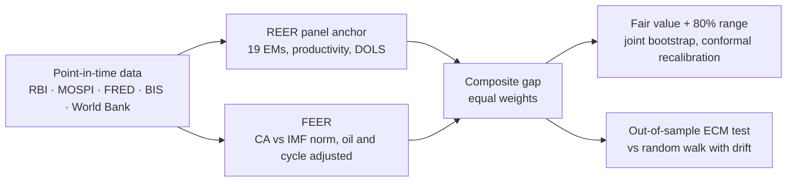

# INR/USD Fair Value Model

[](https://github.com/georgeqanfin-stack/inr-fair-value/actions/workflows/tests.yml)

A point-in-time fair value model for the Indian rupee. It combines a 19-country panel
REER anchor with an IMF-style FEER (external sustainability), puts one joint uncertainty
range around the result, and checks itself against the IMF's own assessments, peer
currencies and out-of-sample forecasts. Every number uses only data that was public at
the date it describes. Data: RBI, MOSPI, FRED, BIS and World Bank, January 2000 onward.

**Version 1.1.** History in [CHANGELOG.md](CHANGELOG.md).

## Current reading

Data as of **September 2026** (run of 2 Oct 2026). For later months see
[`reports/latest/note.md`](reports/latest/note.md), which the monthly refresh rewrites.

| | Misalignment | Fair INR/USD |
|---|---|---|
| **Composite** (equal-weighted) | **+15.7%** | **82.50** |
| REER component: panel anchor, 19 EMs | +18.4% | 80.57 |
| FEER: IMF norm path, cyclically adjusted | +13.0% | 84.46 |
| 80% range (joint bootstrap, recalibrated) | +11.2% to +22.5% | 77.90 – 85.77 |

Positive = rupee weaker than fair. Spot is 95.41, above the whole range, and all
2,000 joint draws say undervalued. **This is a valuation gauge, not a timing signal:**
the gap does not forecast the rupee significantly better than a random walk with drift
(12-month RMSE ratio 0.964, Clark-West p 0.12).

## How it works



- **Point in time.** Two panels: values by the month they refer to, and what was public
  at each month-end (publication lags in the config). Every model is re-estimated on an
  expanding window using only the second; tests check that future data cannot move past
  readings.
- **REER component.** India's own history cannot pin down an equilibrium, so, as in the
  IMF's EBA REER model, the slope comes from a panel of 19 emerging markets (annual BIS
  REERs on relative productivity, country fixed effects, dynamic OLS).
- **FEER.** India's underlying current account (oil and cycle adjusted) against the
  IMF's published norm, converted to a REER gap with the EBA semi-elasticity.
- **Range.** 2,000 draws a month over the panel parameters, the norm, trade
  elasticities, current-account error and the weights, widened by a factor learned from
  its own past misses.
- **Diagnostics, not inputs:** a BEER, Markov-switching regimes, flow attribution with
  RBI intervention, forward premia and real-time data vintages.

Full detail: [docs/METHODOLOGY.md](docs/METHODOLOGY.md).

## How it is validated

- **The IMF's own assessments:** same sign as the IMF's current-account model in all
  9 assessed years (2017–2025), on average 2.2 points apart.
- **Peers:** across 19 currencies, it ranks them as the IMF's REER model does (mean rank
  correlation 0.83), and it moves the expected way in 6 of 7 crises listed in advance.
- **Calibration:** the range covers the later re-estimated fair value 78% of the time on
  years left out of the fit (target 80%).
- **Forecasts:** correctly signed error correction in every out-of-sample window, but
  not significantly better than a random walk.
- **Replication:** a fresh clone, run offline without an API key, reproduces every
  headline figure exactly; 164 tests, lint and a Docker build run on every push.

Every choice made after seeing a result, and the open questions for reviewers, are in
[docs/REVIEW.md](docs/REVIEW.md).

## Quick start

```bash
pip install -r requirements.txt
pip install -e .
python -m inrfv.run            # cached data in data/raw -> outputs/runs/<run-id>/
python -m inrfv.refresh        # re-download everything, check, run, summarise
python -m pytest               # 164 tests, about 7 minutes
```

Or with Docker (same results, no local Python setup):

```bash
docker build --build-arg GIT_REVISION=$(git rev-parse --short HEAD) -t inrfv .
docker run --rm -v "$PWD/outputs:/app/outputs" inrfv
```

Optional: copy `.env.example` to `.env` and set `FRED_API_KEY`. Never put the key in
`.env.example`, which is tracked (a test fails if it holds a value). Without a key the
pipeline uses FRED's public CSV endpoint and skips US CPI vintages (ALFRED). After
editing anything in `data/raw` by hand, run `python -m inrfv.run --write-raw-manifest`.

## Outputs

Each run writes `outputs/runs/<YYYYMMDD-HHMMSS>/` (never overwritten;
`outputs/latest.txt` names the newest):

| File | Contents |
|---|---|
| `note.md` | One-page plain-language summary: the reading, what changed, regime risk, how far to trust it, to-dos. Fixed wording rules; every figure comes from `results.json` |
| `dashboard.html` | Self-contained interactive monitor: verdict, fair value and range against spot, components, stress probability, forecast record, data freshness; light and dark |
| `report.md` | Full report: every model, test and diagnostic, data warnings, charts |
| `results.json` | Every statistic in the report, machine-readable |
| `manifest.json` | Code revision, full config and its hash, SHA-256 of every raw input |
| `panel_*.csv`, `model_*.csv`, `composite_*.csv`, `oos_forecasts_*m.csv` | The data (by reference and publication month), model outputs, forecasts |

The refresh also publishes these to `reports/latest/` and `reports/<YYYY-MM>/`.

## Monthly refresh

`python -m inrfv.refresh --commit`:

1. Backs up `data/raw` and re-downloads every automatic source.
2. Runs quality gates. **Hard failures** restore the backup and exit with code 1:
   cached history that disappeared, a schema violation, or an implausible monthly move
   in INR/USD, the REER or the dollar index. **Warnings** do not stop the run: overdue
   manual inputs, RBI source disagreements outside the revision window, stale series.
3. Re-pins `data/raw/MANIFEST.sha256`, runs the pipeline, writes `refresh_summary.md`
   (new and revised observations, gates, how the headline moved and why), publishes
   the reports and commits `data/raw` and `reports/`. Any error restores `data/raw`.

Each committed refresh is a dated snapshot of the inputs, so the git history doubles as
a data vintage archive: `python -m inrfv.vintages run <git-rev>` re-runs any of them.

**Scheduling.** Either on GitHub (`.github/workflows/monthly-refresh.yml`: the 15th of
each month, or by hand from the Actions tab; tests first, then commits and pushes only
if every gate passes) or on a Windows PC:

```
powershell -ExecutionPolicy Bypass -File scripts\schedule_monthly_refresh.ps1
```

This runs `scripts\monthly_refresh.cmd` on the 15th at 09:00, catches up at the next
logon, logs to `outputs\refresh_logs\` and commits locally without pushing (`-Remove`
deletes it).

**Manual inputs** (the refresh warns when they look out of date):

| File | When | Source |
|---|---|---|
| `data/raw/manual/imf_ca_norm_india.csv` | yearly, after the IMF External Sector Report (July) | ESR individual economy assessment for India, "EBA Norm" |
| `data/raw/manual/imf_eba_india.csv`, `imf_eba_panel.csv` | yearly, same release | `scripts/extract_imf_eba.py` on the EBA estimate tables |
| `data/raw/manual/mospi_cpi_2024base.csv` | only if the RBI API lags MOSPI's release (~12th) | MOSPI CPI press release, Annexure IV |

Sources are listed in [docs/METHODOLOGY.md](docs/METHODOLOGY.md#7-data-sources) and
[`data/raw/manual/README.md`](data/raw/manual/README.md).

## Known limitations

The full list, with the questions we would most like an outside reviewer to check, is
in [docs/REVIEW.md](docs/REVIEW.md) (section 8). In short:

- **No significant forecasting power** at any horizon (12-month Clark-West p 0.12). The
  gap is a valuation gauge, not a timing signal.
- **The panel anchor is suggestive, not conclusive:** productivity-only was chosen as
  the one variant to pass the original Fisher check; over the 16-specification family
  the formal test gives Holm 0.25 and BH 0.09. The World
  Bank fundamentals lag one to two years.
- **Norm sensitivity:** the IMF and NIIP-stabilising norms differ by about 1.6 pp of
  GDP, worth 10–12 points of misalignment, more than the range. Before Feb 2013 the norm
  is backcast (−3.4%), so the 2002–08 FEER readings (+25 to +55%) mostly reflect that.
  The 2017 EBA vintage is not online, so the 2016 norm carries forward until Jul 2018.
- **The range is calibrated on nine years** against an ex-post value that is itself a
  model output (final panel fit, the IMF's later norm). Its miscalibration was not stable
  over time (v1.1).
- **Real-time India data** only from the vintage archive (Oct 2026 on); before that,
  publication lags are modelled but revisions to CPI, trade and national accounts are
  not. RBI revision effects are a lower bound.
- **The flow effect is bounded** (0 to −0.13% per US$1 bn), not point-identified; free EM
  fund-flow data do not exist.
- The India-only anchor and the BEER are not cointegrated, and a panel-estimated CA
  norm was dropped (R² 0.09).

## Development

```bash
pip install -r requirements.txt -r requirements-dev.txt && pip install -e .
ruff check src tests scripts       # lint (rules and the reasons for the few exceptions in pyproject.toml)
mypy src                           # type check
python -m pytest --cov             # tests; fails below 85% coverage
```

CI (`.github/workflows/tests.yml`) runs three jobs on every push: lint and types; tests
with coverage; and a Docker build, with the full test suite run inside the image.

**Data schemas.** Every cached input in `data/raw` has a declarative rule in
`src/inrfv/data/schemas.py`: exact columns, parseable dates, unique keys, numeric
values, and plausible ranges for key series. The monthly refresh treats any violation
as a hard failure and restores `data/raw`; ordinary runs list violations as warnings.
A source that changes its format then stops the pipeline with a clear message.

**Slow diagnostics are cached** in `outputs/cache/`, keyed on a hash of their input
data and settings, and recomputed only when those change. These are the panel
cointegration family (999 bootstrap draws) and the TVTP regime comparison.

## Repository layout

```
config/default.toml        all parameters and assumptions
src/inrfv/                 pipeline package (data, models, stats, backtest, report, run)
tests/                     unit, parser, no-look-ahead, simulation and end-to-end tests
scripts/                   IMF EBA extraction, panel-cointegration Monte Carlo, scheduler
Dockerfile                 reproducible environment (built and tested in CI)
data/raw/                  inputs + MANIFEST.sha256
docs/                      methodology, review write-up
data/processed/, outputs/*.png, notebooks/   legacy v0.1–0.2 artefacts (see notebooks/README.md)
outputs/runs/              pipeline runs (git-ignored)
reports/latest/, reports/<YYYY-MM>/   published report and refresh summary (committed)
```
