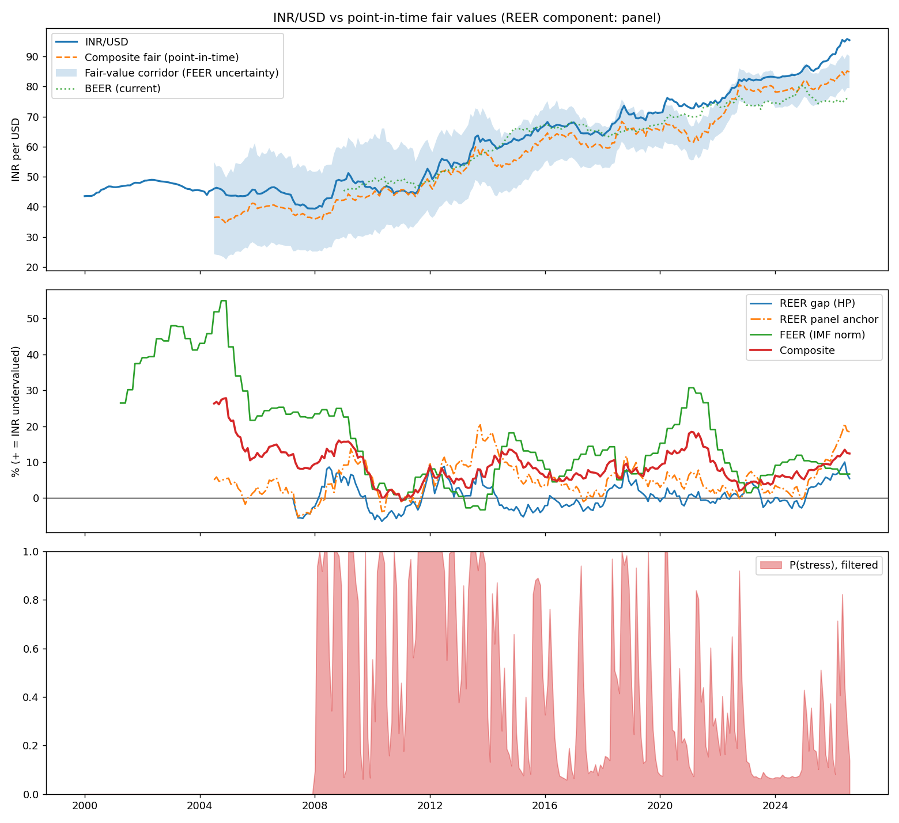
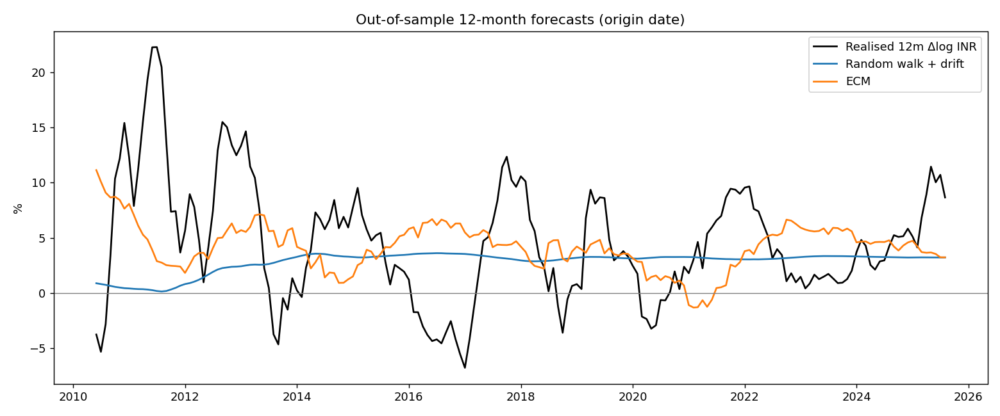

# INR/USD fair value: run report

Run `20261001-101743` · as of **Aug 2026** (latest month with RBI INR/USD) · spot **95.44**

All figures are point-in-time: each value uses only data published by that month-end. Positive misalignment = INR undervalued (weaker than fair).

## Current reading

| Model | As of | Misalignment | Fair INR/USD | Notes |
|---|---|---|---|---|
| REER gap (one-sided HP) | Aug 2026 | +5.4% | 90.55 | cyclical gauge; mean-reverting by construction |
| REER panel anchor (EM panel) | Aug 2026 | +18.4% | 80.60 | productivity-based; BIS REER; spec 'prod' |
| REER fundamentals anchor | Aug 2026 | +10.1% | 86.64 | **not cointegrated**: reported only |
| FEER, IMF norm path (central) | Aug 2026 | +6.7% | 89.46 | BoP Oct–Dec 2025; 10–90th pct +1.2% to +13.6% |
| FEER, fixed IMF −2.0% norm | Aug 2026 | +6.7% | n/a | for comparison |
| FEER, NIIP-stabilising norm | Aug 2026 | -3.4% | n/a | alternative norm |
| FEER, legacy −2.5% norm | Aug 2026 | +9.8% | n/a | v0.2 assumption, for comparison |
| FEER conditional (experimental) | Aug 2026 | -0.9% | n/a | ad hoc norm, not in composite |
| BEER, current (real INR/USD, DOLS) | Aug 2026 | +25.8% | 75.89 | **not cointegrated**: descriptive only |
| BEER, total (permanent fundamentals) | Aug 2026 | +21.5% | 78.55 | fundamentals at one-sided HP trend |
| Composite (REER+FEER) | Aug 2026 | +12.4% | 84.91 | drives the ECM |

**Fair-value corridor (10th–90th percentile of FEER norm and elasticity uncertainty): 79.50 – 90.13** (central 84.91, spot 95.44).

### FEER, latest quarter

Quarter from Oct 2025, public Apr 2026: 4-quarter CA -0.42% of GDP; oil adjustment -0.52pp (net oil imports 3.13% of GDP, Brent paid $69 vs 5-year norm $81); underlying CA -0.94%. Norms: IMF path -2.0% (IMF Country Report 25/314 (2025 Article IV): norm -2.0 percent of GDP with standard error 0.7 [FY2024/25]), fixed IMF -2.0%, NIIP-stabilising -0.40%, legacy -2.5%. Semi-elasticity -0.158 pp/1% (EBA shares, carried; X 21.5%, M 23.8% of GDP).

### REER panel anchor

REER component used in the composite: **panel**. Panel dynamic OLS with country fixed effects, annual BIS broad REER, 19 emerging markets, standard errors clustered by country; India's equilibrium = its country effect + pooled coefficients x its latest fundamentals.

| Spec | Years | n | Coefficients (t) | Panel coint. p | Countries rejecting | India p | India gap (last full year) |
|---|---|---|---|---|---|---|---|
| prod (central) | 1996–2024 | 551 | rel_prod +0.309 (+4.4, exp. +) | 0.025 | 21% | 0.08 | +8.8% (2025) |
| long | 1996–2024 | 549 | rel_prod +0.294 (+4.0, exp. +), gov_cons +0.004 (+0.5, exp. +), openness +0.001 (+0.5, exp. -) | 0.976 | 0% | 0.31 | +8.6% (2025) |
| short | 2007–2023 | 323 | rel_prod +0.147 (+0.7, exp. +), log_tot +0.166 (+0.9, exp. +), gov_cons -0.000 (-0.0, exp. +), openness -0.004 (-1.7, exp. -) | 0.999 | 5% | 0.45 | +2.6% (2025) |

Coefficient range across 23 point-in-time re-estimations since 2004-07: rel_prod +0.31 to +0.87. Twelve specifications were compared when this model was built; only productivity-only DOLS passed the panel check, so treat the cointegration result as suggestive.

### BEER (bilateral, real INR/USD)

Real INR/USD with PPP imposed, regressed by dynamic OLS on long-run fundamentals; expanding window, first estimate 2009-01. Current BEER uses today's fundamentals; total BEER uses their one-sided HP trends.

| Spec | Sample | n | Coefficients (t, expected sign) | Engle-Granger p | Johansen rank |
|---|---|---|---|---|---|
| core (central) | 2001-02–2026-08 | 300 | log_dxy +0.720 (+8.5, +), rel_prod -0.413 (-8.6, -), real_rate_diff -0.002 (-0.4, -) | 0.980 | 0 |
| dxy | 2000-02–2026-08 | 313 | log_dxy +0.436 (+2.3, +) | 0.775 | 0 |
| oil | 2001-02–2026-08 | 300 | log_dxy +1.051 (+7.4, +), rel_prod -0.553 (-9.9, -), real_rate_diff -0.001 (-0.3, -), log_brent +0.117 (+3.5, +) | 0.993 | 0 |

Coefficient range across re-estimations: log_dxy +0.28 to +0.72, rel_prod -0.83 to -0.42, real_rate_diff -0.00 to +0.01.

Does the BEER gap predict INR/USD? (same out-of-sample test as the composite)

| h | OOS window | n | RMSE ratio vs drift | Clark-West p | α range |
|---|---|---|---|---|---|
| 1 | 2014-01–2026-07 | 151 | 1.006 | 0.631 | -0.03 to +0.00 |
| 3 | 2014-03–2026-05 | 147 | 1.053 | 0.554 | -0.17 to -0.03 |
| 6 | 2014-06–2026-02 | 141 | 1.070 | 0.440 | -0.27 to -0.08 |
| 12 | 2014-12–2025-08 | 129 | 1.074 | 0.096 | -0.55 to -0.29 |

Reading: the dollar and productivity coefficients are large, significant and correctly signed, but the real rate is not cointegrated with them, so the BEER gap describes where fundamentals would put the rupee, not a level it reliably returns to.

### REER fundamentals anchor (India only)

Dynamic OLS, 2005-07–2026-04, n=82: log REER on relative productivity +0.150 (t +2.4, expected +), log terms of trade +0.101 (t +0.8, expected +), NFA/GDP -0.241 (t -0.8, expected +). Engle-Granger p = 0.85 (5% critical -4.23). Range of each coefficient across the quarterly re-estimations since 2013-07: rel_prod +0.01 to +1.51, log_tot -0.04 to +0.68, nfa_gdp -0.24 to +2.18. NFA source quarters: {'BPM5': 49, 'BPM6': 29, 'cumulated CA': 2, 'interpolated': 1, 'not yet published': 1}.

Reading: India's productivity relative to the world has more than doubled since 2005 while the REER stayed within a narrow range, so the fundamentals do not pin down the REER level over this sample (consistent with a managed exchange rate). The anchor's misalignment is therefore not used in the composite unless `[composite] reer_component = "anchor"`.

Cross-check, FY2024/25: this model's CA -0.59% and underlying CA -0.50% vs the IMF's -0.6% actual and -0.4% cyclically adjusted (2025 Article IV); misalignment +9.6% (IMF: external position "moderately stronger" than fundamentals).

## Regime

Filtered P(stress) = **0.14** (2026-08), steady state 0.34. Forward: 1m 0.21, 3m 0.29, 6m 0.33, 12m 0.34.
Calm: mean +0.10%/mo, sd 0.76%, duration 7.8m. Stress: mean +0.49%/mo, sd 2.40%, duration 4.1m.

Oil × DXY quadrant (expanding medians): OilHi_DXYHi (Aug 2026).

## Out-of-sample backtest (ECM vs random walk with drift)

| h | OOS window | n | RMSE ratio | OOS R² | Clark-West p | DM p | hit ECM | hit naive 'depreciate' | hit vs drift | α range |
|---|---|---|---|---|---|---|---|---|---|---|
| 1 | 2009-07–2026-07 | 205 | 0.999 | +0.003 | 0.153 | 0.875 | 58% | 59% | 48% | -0.06 to -0.01 |
| 3 | 2009-09–2026-05 | 201 | 1.006 | -0.011 | 0.283 | 0.768 | 60% | 63% | 42% | -0.20 to -0.03 |
| 6 | 2009-12–2026-02 | 195 | 1.015 | -0.030 | 0.210 | 0.721 | 68% | 71% | 41% | -0.41 to -0.09 |
| 12 | 2010-06–2025-08 | 183 | 0.977 | +0.046 | 0.130 | 0.819 | 80% | 83% | 52% | -0.77 to -0.25 |

RMSE ratio < 1 and Clark-West p < 0.05 would mean the ECT beats the drift benchmark. 'hit vs drift' asks whether the model gets the direction of the surprise relative to drift right.

### Full-sample predictive regressions

| h | β (Hodrick) | t (Hodrick 1B) | p | non-overlapping β median [min, max] | t median |
|---|---|---|---|---|---|
| 1 | -0.045 | -2.11 | 0.035 | -0.045 [-0.04, -0.04] | -2.03 |
| 3 | -0.119 | -1.86 | 0.063 | -0.118 [-0.13, -0.11] | -1.49 |
| 6 | -0.221 | -1.92 | 0.055 | -0.212 [-0.30, -0.13] | -1.34 |
| 12 | -0.435 | -1.89 | 0.058 | -0.435 [-0.59, -0.29] | -1.26 |

Regime-conditional (h=12, filtered P(stress)): α_calm -0.230 (p=0.429), α_stress -0.321 (p=0.368).

## Current ECM forecast

h=12m from 2026-08: ECT +0.117, α -0.435, const +0.071 → predicted Δlog INR +2.0% (drift alone +3.4%). Estimated on all realised targets; only as credible as the backtest above.

## Diagnostics

- BEER Engle-Granger (4 vars, n=307): stat -1.22, 5% critical -4.13, p = 0.980.
- Johansen PPP [log INR, log CPI India, log CPI US]: rank 0 of 3 (sequential trace, 5%, k_ar_diff=1, n=319).
- DXY splice: ratio 1.1937; log change at seam 2006-01: -2.40%.
- India CPI: official MOSPI CPI-Combined (inflation as published at the time). Segments: CPI-IW chained 1988-10–2010-12; MOSPI 2012 back series x LF 2011-01–2012-12; MOSPI 2012 x LF 2013-01–2025-12; MOSPI 2024 (chained) 2026-01–2026-08. Linking factor 2012→2024 0.5267 (2025 overlap ratio 0.5267); CPI-IW 1982→2001 factor 4.63. Inflation vs the old OECD series: corr 0.966, mean |diff| 0.41pp.
- India policy rate source: FRED IRSTCI01INM156N (overnight call rate).
- Call rate vs RBI repo rate (2008-06–2026-07): mean gap +0.32pp, mean |gap| 0.68pp, corr 0.800.
- FPI series: legacy FII before 2011-03, BoP net portfolio after.

## RBI data sources

RBIH Data API merged with DBIE Excel (later vintage preferred). API fetched 2026-10-01T04:47:03+00:00, mirror loaded 2026-10-01T04:38:30.

| Series | API range | Excel range | Later vintage | Overlap | Revised | Unexpected diffs |
|---|---|---|---|---|---|---|
| inr_usd | 1992-03–2026-06 | 1992-03–2026-04 | api | 410 | 0 | 0 |
| reer | 2004-04–2026-07 | 2004-04–2026-04 | api | 265 | 0 | 0 |
| neer | 2004-04–2026-07 | 2004-04–2026-04 | api | 265 | 1 | 0 |
| fx_reserves_usd_mn | 1951-03–2026-08 | 1990-03–2026-02 | api | 430 | 0 | 0 |
| exports_usd_mn | 1990-04–2026-06 | 1990-04–2026-03 | api | 432 | 0 | 0 |
| imports_usd_mn | 1990-04–2026-06 | 1990-04–2026-03 | api | 432 | 4 | 0 |
| fdi_usd_mn | 2011-03–2026-06 | 2011-03–2026-03 | api | 181 | 12 | 0 |
| fpi_usd_mn | 2011-03–2026-06 | 2011-03–2026-03 | api | 181 | 3 | 0 |
| bop.current_account | 1990-04–2025-07 | 2000-04–2025-10 | xlsx | 102 | 2 | 0 |
| bop.merch_balance | 1990-04–2025-07 | 2000-04–2025-10 | xlsx | 102 | 1 | 0 |
| bop.private_transfers | 1990-04–2025-07 | 2000-04–2025-10 | xlsx | 102 | 0 | 0 |
| bop.capital_account | 1990-04–2025-07 | 2000-04–2025-10 | xlsx | 102 | 2 | 0 |
| bop.fdi_bop | 1990-04–2025-07 | 2000-04–2025-10 | xlsx | 102 | 2 | 0 |
| bop.portfolio_bop | 1990-04–2025-07 | 2000-04–2025-10 | xlsx | 102 | 0 | 0 |
| bop.loans | 1990-04–2025-07 | 2000-04–2025-10 | xlsx | 102 | 1 | 0 |
| bop.banking_capital | 1990-04–2025-07 | 2000-04–2025-10 | xlsx | 102 | 0 | 0 |
| bop.reserve_change | 1990-04–2025-07 | 2000-04–2025-10 | xlsx | 102 | 0 | 0 |

INR/USD patched with rescaled FRED EXINUS: filled ['2026-05'], extended ['2026-07', '2026-08'] (mean RBI–FRED gap 0.31%).

## Data warnings

- INR/USD uses rescaled FRED EXINUS for 2026-05, 2026-07, 2026-08 (RBI data missing; typical RBI-FRED gap 0.31%).
- fx_reserves_usd_mn has missing months inside its range: 2026-04.
- Latest BoP quarter is Oct 2025 (quarter start); the next one was due by Jul 2026. Download a fresh BoP file from DBIE or wait for the RBIH API to update.
- REER anchor fundamentals are not cointegrated with the REER (Engle-Granger p=0.85); the anchor is reported, not relied on.
- BEER residuals are not cointegrated (Engle-Granger p=0.98); treat the BEER fair value as descriptive.

## Series end dates (reference month)

inr_usd 2026-08, reer 2026-07, neer 2026-07, fx_reserves_usd_mn 2026-08, exports_usd_mn 2026-06, imports_usd_mn 2026-06, fdi_usd_mn 2026-06, fpi_usd_mn 2026-06, dxy 2026-09, cpi_us 2026-08, fed_funds_rate 2026-08, vix 2026-09, us_10y_yield 2026-08, brent 2026-09, fed_balance_sheet 2026-09, india_stir 2026-07, cpi_india 2026-08, cpi_india_yoy 2026-08, india_policy_rate 2026-07, india_repo_rate 2026-09, india_wacr 2026-03

## Charts

