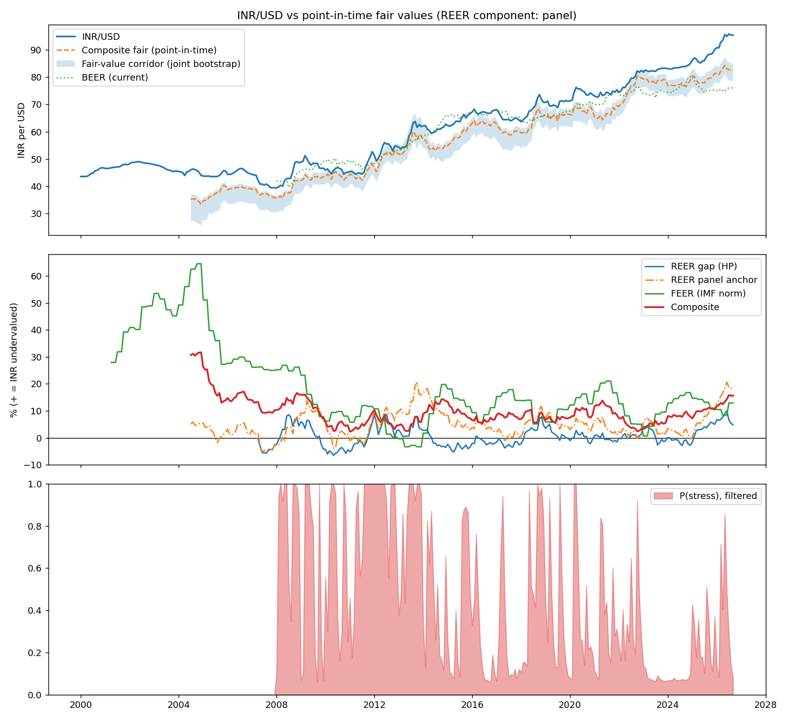
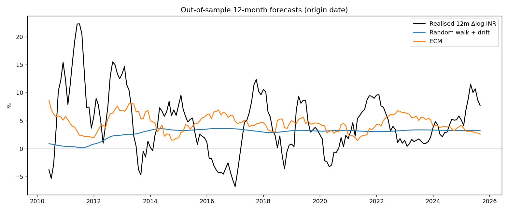

# INR/USD fair value: run report

inrfv 0.17.0 · run `20261001-222256` · as of **Sep 2026** (latest month with RBI INR/USD) · spot **95.41**

All figures are point-in-time: each value uses only data published by that month-end. Positive misalignment = INR undervalued (weaker than fair).

## Current reading

| Model | As of | Misalignment | Fair INR/USD | Notes |
|---|---|---|---|---|
| REER gap (one-sided HP) | Sep 2026 | +4.8% | 91.06 | cyclical gauge; mean-reverting by construction |
| REER panel anchor (EM panel) | Sep 2026 | +18.4% | 80.57 | productivity-based; BIS REER; spec 'prod' |
| REER fundamentals anchor | Sep 2026 | +10.1% | 86.62 | **not cointegrated**: reported only |
| FEER, IMF norm path (central) | Sep 2026 | +13.0% | 84.46 | BoP Jan–Mar 2026; 10–90th pct +7.7% to +20.8% |
| FEER, fixed IMF −2.0% norm | Sep 2026 | +11.0% | n/a | for comparison |
| FEER, NIIP-stabilising norm | Sep 2026 | +0.9% | n/a | alternative norm |
| FEER, legacy −2.5% norm | Sep 2026 | +14.2% | n/a | v0.2 assumption, for comparison |
| FEER conditional (experimental) | Jun 2026 | +0.6% | n/a | ad hoc norm, not in composite |
| BEER, current (real INR/USD, DOLS) | Sep 2026 | +25.1% | 76.27 | **not cointegrated**: descriptive only |
| BEER, total (permanent fundamentals) | Sep 2026 | +21.4% | 78.56 | fundamentals at one-sided HP trend |
| Composite (REER+FEER) | Sep 2026 | +15.7% | 82.50 | drives the ECM |

**Fair-value corridor (10th–90th percentile; joint bootstrap of panel parameters, FEER norm, elasticities, CA measurement and model weights): 78.70 – 85.08** (central 82.50, spot 95.41).

### FEER, latest quarter

Quarter from Jan 2026, public Jul 2026: 4-quarter CA -0.68% of GDP; oil adjustment +nanpp (net oil imports n/a% of GDP, Brent paid $70 vs 5-year norm $82); underlying CA -0.29%. Norms: IMF path -2.3% (IMF 2026 External Sector Report (30 Jul 2026) Table 2.11 India: EBA norm -2.3 percent of GDP with standard error 0.6 [FY2025/26]), fixed IMF -2.0%, NIIP-stabilising -0.43%, legacy -2.5%. Semi-elasticity -0.155 pp/1% (EBA shares; X 21.6%, M 24.7% of GDP).

Cyclical adjustment (applied): India's output gap +1.57% vs partners' +0.48% (relative +1.10pp) x EBA coefficient -0.3564 = -0.39pp of GDP from the cycle; underlying CA before it -0.68%. Income term (applied): net primary income -1.26% of GDP, foreign-currency share 0.5 (uniform 0-1 in the bands); trade-only semi-elasticity -0.161.

### REER panel anchor

REER component used in the composite: **panel**. Panel dynamic OLS with country fixed effects, annual BIS broad REER, 19 emerging markets, standard errors clustered by country; India's equilibrium = its country effect + pooled coefficients x its latest fundamentals.

| Spec | Years | n | Coefficients (t) | Panel coint. p | Countries rejecting | India p | India gap (last full year) |
|---|---|---|---|---|---|---|---|
| prod (central) | 1996–2024 | 551 | rel_prod +0.309 (+4.4, exp. +) | 0.025 | 21% | 0.08 | +8.8% (2025) |
| long | 1996–2024 | 549 | rel_prod +0.294 (+4.0, exp. +), gov_cons +0.004 (+0.5, exp. +), openness +0.001 (+0.5, exp. -) | 0.976 | 0% | 0.31 | +8.6% (2025) |
| short | 2007–2023 | 323 | rel_prod +0.147 (+0.7, exp. +), log_tot +0.166 (+0.9, exp. +), gov_cons -0.000 (-0.0, exp. +), openness -0.004 (-1.7, exp. -) | 0.999 | 5% | 0.45 | +2.6% (2025) |
| prod_nfa | 1996–2023 | 532 | rel_prod +0.318 (+4.4, exp. +), nfa -0.001 (-0.5, exp. +) | 0.415 | 11% | 0.39 | +10.0% (2025) |

Coefficient range across 23 point-in-time re-estimations since 2004-07: rel_prod +0.31 to +0.87. Twelve specifications were compared when this model was built; only productivity-only DOLS passed the panel check, so treat the cointegration result as suggestive. Net foreign assets (External Wealth of Nations) were tested later and are shown as `prod_nfa`: insignificant, wrong sign, and adding them breaks the panel check.

**Formal panel cointegration tests.** 'Panel coint. p' above is a Fisher combination of per-country ADF tests on the pooled (common-slope) residuals. The tests below allow each country its own slope (Pedroni-type group and panel ADF on country-by-country cointegrating regressions; Westerlund Gt and Pt error-correction tests), with p-values from 999 bootstrap panels generated under no cointegration (years resampled jointly across countries). The primary statistic is the group ADF: in a Monte Carlo (scripts/mc_panel_coint.py) it rejected 5% of non-cointegrated panels at the 5% level, while the Westerlund bootstrap rejected 15-18%, so Westerlund p-values here are too low.

Search family: every specification containing relative productivity (16 specs, 12 with enough years). 5 pass at 5% before adjustment. Holm controls the chance of any false pass; Benjamini-Hochberg (BH) the share of false passes.

| Specification | Years | Group ADF p | Holm | BH | Panel ADF p | Westerlund Gt p | Pt p | Fisher (pooled slope) |
|---|---|---|---|---|---|---|---|---|
| rel_prod | 32 | 0.023 | 0.25 | 0.09 | 0.067 | 0.011 | 0.020 | 0.025 |
| rel_prod + gov_cons | 30 | 0.052 | 0.37 | 0.09 | 0.212 | 0.018 | 0.125 | — |
| rel_prod + openness | 31 | 0.033 | 0.33 | 0.09 | 0.132 | 0.088 | 0.081 | — |
| rel_prod + log_tot | 20 | 0.150 | 0.37 | 0.15 | 0.281 | 0.107 | 0.129 | — |
| rel_prod + nfa | 31 | 0.155 | 0.37 | 0.15 | 0.402 | 0.034 | 0.274 | 0.415 |
| rel_prod + gov_cons + openness | 30 | 0.019 | 0.23 | 0.09 | 0.135 | 0.121 | 0.105 | 0.976 |
| rel_prod + gov_cons + log_tot | 20 | 0.038 | 0.34 | 0.09 | 0.117 | 0.209 | 0.263 | — |
| rel_prod + gov_cons + nfa | 30 | 0.071 | 0.37 | 0.09 | 0.367 | 0.040 | 0.080 | — |
| rel_prod + openness + log_tot | 20 | 0.046 | 0.37 | 0.09 | 0.361 | 0.312 | 0.227 | — |
| rel_prod + openness + nfa | 30 | 0.077 | 0.37 | 0.09 | 0.351 | 0.063 | 0.157 | — |
| rel_prod + log_tot + nfa | 20 | 0.060 | 0.37 | 0.09 | 0.207 | 0.018 | 0.013 | — |
| rel_prod + gov_cons + openness + log_tot | — | too few years | | | | | | 0.999 |
| rel_prod + gov_cons + openness + nfa | 30 | 0.074 | 0.37 | 0.09 | 0.189 | 0.095 | 0.101 | — |
| rel_prod + gov_cons + log_tot + nfa | — | too few years | | | | | | — |
| rel_prod + openness + log_tot + nfa | — | too few years | | | | | | — |
| rel_prod + gov_cons + openness + log_tot + nfa | — | too few years | | | | | | — |

Central specification: group ADF p 0.023; after the search, Holm 0.25 and BH 0.09. Country-by-country cointegration with productivity is broadly supported; the common slope the anchor imposes, and the central specification's p-value after accounting for the search, are suggestive rather than conclusive.

### BEER (bilateral, real INR/USD)

Real INR/USD with PPP imposed, regressed by dynamic OLS on long-run fundamentals; expanding window, first estimate 2008-01. Current BEER uses today's fundamentals; total BEER uses their one-sided HP trends.

| Spec | Sample | n | Coefficients (t, expected sign) | Engle-Granger p | Johansen rank |
|---|---|---|---|---|---|
| core (central) | 2000-02–2026-09 | 313 | log_dxy +0.716 (+10.0, +), rel_prod -0.406 (-9.7, -), real_rate_diff -0.002 (-0.5, -) | 0.973 | 0 |
| dxy | 2000-02–2026-09 | 314 | log_dxy +0.438 (+2.4, +) | 0.772 | 0 |
| oil | 2000-02–2026-09 | 313 | log_dxy +1.036 (+7.8, +), rel_prod -0.541 (-11.7, -), real_rate_diff -0.001 (-0.2, -), log_brent +0.117 (+3.4, +) | 0.981 | 0 |
| fwd | 2000-02–2026-08 | 312 | log_dxy +0.723 (+9.5, +), rel_prod -0.407 (-9.8, -), real_fwd_diff -0.002 (-0.6, -) | 0.978 | 0 |

Coefficient range across re-estimations: log_dxy +0.29 to +0.71, rel_prod -0.93 to -0.41, real_rate_diff -0.00 to +0.01.

Does the BEER gap predict INR/USD? (same out-of-sample test as the composite)

| h | OOS window | n | RMSE ratio vs drift | Clark-West p | α range |
|---|---|---|---|---|---|
| 1 | 2013-01–2026-08 | 164 | 1.006 | 0.789 | -0.02 to +0.03 |
| 3 | 2013-03–2026-06 | 160 | 1.009 | 0.411 | -0.08 to +0.00 |
| 6 | 2013-06–2026-03 | 154 | 1.017 | 0.220 | -0.20 to -0.08 |
| 12 | 2013-12–2025-09 | 142 | 1.055 | 0.062 | -0.58 to -0.33 |

Reading: the dollar and productivity coefficients are large, significant and correctly signed, but the real rate is not cointegrated with them, so the BEER gap describes where fundamentals would put the rupee, not a level it reliably returns to.

### REER fundamentals anchor (India only)

Dynamic OLS, 2005-07–2026-04, n=82: log REER on relative productivity +0.150 (t +2.4, expected +), log terms of trade +0.101 (t +0.8, expected +), NFA/GDP -0.241 (t -0.8, expected +). Engle-Granger p = 0.85 (5% critical -4.23). Range of each coefficient across the quarterly re-estimations since 2013-07: rel_prod +0.01 to +1.51, log_tot -0.04 to +0.68, nfa_gdp -0.24 to +2.18. NFA source quarters: {'BPM5': 49, 'BPM6': 29, 'cumulated CA': 2, 'not yet published': 2, 'interpolated': 1}.

Reading: India's productivity relative to the world has more than doubled since 2005 while the REER stayed within a narrow range, so the fundamentals do not pin down the REER level over this sample (consistent with a managed exchange rate). The anchor's misalignment is therefore not used in the composite unless `[composite] reer_component = "anchor"`.

Cross-check, FY2024/25: this model's CA -0.58% and underlying CA -0.02% vs the IMF's -0.6% actual and -0.4% cyclically adjusted (2025 Article IV); misalignment +13.2% (IMF: external position "moderately stronger" than fundamentals).

## Regime

Filtered P(stress) = **0.08** (2026-09), steady state 0.34. Forward: 1m 0.18, 3m 0.28, 6m 0.33, 12m 0.34.
Calm: mean +0.10%/mo, sd 0.76%, duration 7.8m. Stress: mean +0.49%/mo, sd 2.40%, duration 4.1m.

Oil × DXY quadrant (expanding medians): OilHi_DXYHi (Sep 2026).

### Time-varying transition probabilities

Switching odds driven by last month's VIX change, Brent change, FPI flows and RBI intervention (standardised, point in time), against the constant-probability model. Full sample Apr 2000–Sep 2026; out of sample Apr 2008–Sep 2026: one-step-ahead predictive log score of the monthly return, parameters re-estimated yearly; t-test on the log-score difference (Newey-West); AUC of the predicted stress probability for months with the largest 20% of moves. Rule set beforehand: switch only if a specification beats the constant model out of sample with one-sided p < 0.1.

| Transition drivers | Log-lik. | AIC | BIC | LR p | OOS log score | vs constant | t | p | AUC big moves |
|---|---|---|---|---|---|---|---|---|---|
| none (constant) | -543.3 | 1098.6 | 1121.1 | — | -1.9451 | +0.0000 | — | — | 0.66 |
| VIX (change) | -542.9 | 1101.9 | 1132.0 | 0.72 | -1.9604 | -0.0153 | -1.52 | 0.94 | 0.64 |
| Brent (% change) | -542.9 | 1101.8 | 1131.9 | 0.70 | -1.9487 | -0.0036 | -0.52 | 0.70 | 0.64 |
| FPI flows | -541.7 | 1099.3 | 1129.4 | 0.20 | -1.9722 | -0.0271 | -0.85 | 0.80 | 0.65 |
| RBI intervention | -542.2 | 1100.5 | 1130.6 | 0.35 | -1.9639 | -0.0188 | -1.03 | 0.85 | 0.65 |
| VIX (change), Brent (% change), FPI flows, RBI intervention | -541.1 | 1110.2 | 1162.8 | 0.82 | -2.4697 | -0.5247 | -2.27 | 0.99 | 0.58 |

Choice: **constant**.

## Market pricing (forward premia)

RBI inter-bank forward premia, monthly average (% a year), Jun 2026: 3-month 3.10%, 6-month 2.98%. Implied forwards on the Sep 2026 spot 95.41: 3-month 96.15, 6-month 96.83.

Premium over the policy-rate gap (3-month premium − (India policy rate − Fed funds)): +1.23 pp in Jun 2026, above 86% of months since 2000 (mean -0.37, sd 1.64). A high spread means dollars for future delivery cost more than the rate gap justifies: hedging demand and expected depreciation beyond carry.

Does the spread predict next month's rupee move? Coefficient -0.048% per pp (t -0.6); controlling for next month's dollar move -0.073 (t -1.2).

| UIP test | Sample | n | Slope (UIP = 1) | t vs 0 | t vs 1 | R² |
|---|---|---|---|---|---|---|
| 3m premium → 3-month depreciation | 2000-01–2026-06 | 318 | 0.60 (se 0.44) | +1.3 | -0.9 | 0.012 |
| 6m premium → 6-month depreciation | 2000-01–2026-03 | 315 | 0.59 (se 0.46) | +1.3 | -0.9 | 0.018 |

## Flow attribution (what moved the spot rate)

Monthly INR/USD % change regressed on net FPI and FDI flows (US$ bn), dollar-index and Brent % changes, 2011-03 to 2026-06 (n = 184, R² 0.34, Newey-West t). Ex post, by reference month; it explains spot moves and does not enter the fair value. Positive = rupee weaker.

| Term | Coefficient | t | Meaning |
|---|---|---|---|
| const | +0.530 | +3.7 | average monthly depreciation (drift) |
| fpi | -0.131 | -4.3 | % per US$1bn of net FPI inflow |
| fdi | -0.043 | -1.1 | % per US$1bn of net FDI inflow |
| dxy | +0.456 | +4.5 | % per 1% dollar-index rise |
| brent | -0.003 | -0.4 | % per 1% Brent rise |

| Window | Actual | Portfolio flows (FPI) | Direct investment (FDI) | Dollar index | Oil (Brent) | Drift | Residual | FPI, fitted without the window |
|---|---|---|---|---|---|---|---|---|
| Apr 2026–Jun 2026 | +2.4% | +1.3 | -0.3 | +0.1 | +0.1 | +1.6 | -0.3 | +1.2 |
| Jul 2025–Jun 2026 | +10.0% | +3.8 | -0.3 | -0.2 | -0.1 | +6.4 | +0.4 | +3.7 |

Direction: FPI this month → INR next month t -2.6 (p 0.009); INR last month → FPI this month t -2.0 (p 0.050). Reading: one-way or none at the 5% level. Flow data end Jun 2026.

### RBI intervention

RBI Bulletin Table 4: spot net purchases plus the change in the outstanding forward book (US$ bn; negative = net dollar sales). Intervention is not a regressor: the RBI sells because the rupee is under pressure, and a direct regression finds +0.002% per US$1bn (t +0.2). Reaction function: the RBI buys +1.20 bn per US$1bn of net FPI inflow (t +4.8) and -0.72 bn per 1% rupee depreciation (t -1.7); R² 0.31.

Absorbed pressure values each dollar the RBI sold at the market price implied by the FPI coefficient (0.131% per US$1bn). That coefficient is net of the RBI's usual response, so the absorbed share is a lower bound; it scales linearly with the price.

| Window | RBI net sales | Actual move | Held stronger by | Move without RBI | Share absorbed |
|---|---|---|---|---|---|
| Apr 2026–Jun 2026 | US$14.7 bn | +2.4% | +1.9 pts | +4.3% | 45% |
| Jul 2025–Jun 2026 | US$107.0 bn | +10.0% | +14.0 pts | +24.0% | 58% |

Outstanding net forward position, Jul 2026: US$-136.8 bn (-20% of FX reserves). Latest month of intervention data: Jul 2026 (US$-14.8 bn).

## Out-of-sample backtest (ECM vs random walk with drift)

| h | OOS window | n | RMSE ratio | OOS R² | Clark-West p | DM p | hit ECM | hit naive 'depreciate' | hit vs drift | α range |
|---|---|---|---|---|---|---|---|---|---|---|
| 1 | 2009-07–2026-08 | 206 | 0.996 | +0.009 | 0.107 | 0.639 | 58% | 58% | 50% | -0.06 to -0.01 |
| 3 | 2009-09–2026-06 | 202 | 1.000 | -0.000 | 0.224 | 0.998 | 63% | 63% | 43% | -0.19 to -0.04 |
| 6 | 2009-12–2026-03 | 196 | 0.998 | +0.004 | 0.174 | 0.965 | 71% | 71% | 41% | -0.35 to -0.10 |
| 12 | 2010-06–2025-09 | 184 | 0.964 | +0.070 | 0.121 | 0.696 | 83% | 83% | 48% | -0.70 to -0.25 |

RMSE ratio < 1 and Clark-West p < 0.05 would mean the ECT beats the drift benchmark. 'hit vs drift' asks whether the model gets the direction of the surprise relative to drift right.

### Composite weights

Weighting schemes for the REER component and the FEER, all point in time, through the same backtest. Rule set beforehand: keep equal weights unless a scheme lowers the 12-month RMSE ratio by at least 0.01 and has a lower Clark-West p. The rule chooses: **equal** (configured: equal). Headline misalignment across the combination schemes: +15.1% to +15.8%.

| Scheme | REER weight (latest, mean) | Misalignment now | 1m RMSE ratio (CW p) | 3m RMSE ratio (CW p) | 6m RMSE ratio (CW p) | 12m RMSE ratio (CW p) |
|---|---|---|---|---|---|---|
| Equal (1/2 each) | 0.50, 0.50 | +15.7% | 0.996 (0.11) | 1.000 (0.22) | 0.998 (0.17) | 0.964 (0.12) |
| REER component only | 1.00, 1.00 | +18.4% | 1.004 (0.28) | 1.017 (0.47) | 1.070 (0.69) | 1.231 (0.50) |
| FEER only | 0.00, 0.00 | +13.0% | 1.004 (0.48) | 1.013 (0.53) | 1.009 (0.35) | 1.025 (0.44) |
| Inverse variance (bands) | 0.39, 0.15 | +15.1% | 1.004 (0.49) | 1.014 (0.53) | 1.009 (0.34) | 1.020 (0.38) |
| Performance (Bates-Granger) | 0.54, 0.50 | +15.8% | 0.997 (0.13) | 1.002 (0.24) | 0.999 (0.18) | 0.963 (0.12) |

### Nonlinear and time-varying adjustment

Each variant is re-estimated point in time like the headline ECM and scored the same way. Rule set before testing: replace the linear ECM only if a variant lowers the 12-month RMSE ratio by at least 0.01 and has a lower Clark-West p.

| Variant | 1m RMSE ratio (CW p) | 3m RMSE ratio (CW p) | 6m RMSE ratio (CW p) | 12m RMSE ratio (CW p) |
|---|---|---|---|---|
| Linear ECM (headline) | 0.996 (0.11) | 1.000 (0.22) | 0.998 (0.17) | 0.964 (0.12) |
| Threshold ECM | 1.012 (0.15) | 1.030 (0.29) | 1.026 (0.36) | 1.105 (0.41) |
| Cubic (ESTAR approximation) | 1.002 (0.27) | 1.020 (0.58) | 1.018 (0.37) | 1.185 (0.12) |
| Rolling-window ECM | 0.999 (0.09) | 1.000 (0.16) | 0.990 (0.11) | 0.928 (0.05) |
| Time-varying parameters (Kalman) | 1.011 (0.41) | 1.118 (0.62) | 1.207 (0.83) | 1.278 (0.53) |

Latest fits: threshold |gap| 0.122 log points, slope inside +0.23 and outside -0.30; cubic term +2.56 (negative would mean faster reversion of large gaps).

Rolling window, 12-month ratio by window length: 72 months 0.933 (p 0.05), 96 months 0.984 (p 0.12), 120 months 0.928 (p 0.05), 144 months 0.951 (p 0.06), 180 months 0.948 (p 0.06); median 0.948. The rule's choice: **rolling**. Adopted: **rolling**. `[backtest] window_months` switches the headline ECM to a rolling window.

Structural breaks (sup-Wald, 15% trimming, block-bootstrap p; a second break is tested on the larger segment when the first is significant):

| Series | Sample | Break | sup-F | p | Before | After |
|---|---|---|---|---|---|---|
| 12-month ECM (intercept and slope) | 2004-07–2025-09 | Jun 2013 | 13.9 | 0.655 | +0.110, -0.692 | -0.009, +0.542 |
| Mean of composite misalignment | 2004-07–2026-09 | Jul 2009 | 211.9 | 0.005 | +16.3 | +7.9 |
| Mean of composite misalignment | 2009-07–2026-09 | Jan 2014 | 48.9 | 0.195 | +5.7 | +8.7 |
| Mean of REER component misalignment | 2004-07–2026-09 | Dec 2011 | 40.7 | 0.315 | +2.5 | +6.3 |
| Mean of FEER misalignment | 2001-04–2026-09 | Jan 2009 | 724.0 | 0.005 | +38.1 | +10.5 |
| Mean of FEER misalignment | 2009-01–2026-09 | Jul 2014 | 46.5 | 0.245 | +6.8 | +12.1 |

### Joint uncertainty (bootstrap corridor)

2000 joint draws a month of: the panel slope and India's effect (country-block bootstrap, 300 draws per re-estimation), the IMF norm (its standard error), the trade elasticities (±50%), current-account measurement error (sd 0.2 pp of GDP) and the weighting scheme (equal, performance or inverse variance). Sep 2026: fair value 78.70–85.08 (misalignment +12.1% to +21.2%); 100% of draws say undervalued. End-to-end band: 76.96–87.51. Headline corridor: **bootstrap**.

Coverage against the fair value as later re-estimated (Jan 2017–Dec 2025: final panel coefficients; the IMF's own norm for each year), nominal 80%:

| Corridor | Months | Coverage | Ex-post below band | Ex-post above band | Median width |
|---|---|---|---|---|---|
| bootstrap | 108 | 66% | 33% | 1% | 10.6 pp |
| end to end | 108 | 100% | 0% | 0% | 18.9 pp |

Months overlap heavily (about one independent observation a year), so coverage is measured roughly. Misses below the band mean the real-time reading overstated undervaluation relative to the later estimate. The bootstrap corridor was made the headline after this test, as the one closer to nominal coverage.

### Full-sample predictive regressions

| h | β (Hodrick) | t (Hodrick 1B) | p | non-overlapping β median [min, max] | t median |
|---|---|---|---|---|---|
| 1 | -0.050 | -2.39 | 0.017 | -0.050 [-0.05, -0.05] | -2.27 |
| 3 | -0.130 | -2.07 | 0.038 | -0.129 [-0.13, -0.13] | -1.67 |
| 6 | -0.232 | -2.19 | 0.028 | -0.226 [-0.31, -0.12] | -1.44 |
| 12 | -0.430 | -2.05 | 0.041 | -0.430 [-0.62, -0.25] | -1.26 |

Regime-conditional (h=12, filtered P(stress)): α_calm -0.247 (p=0.522), α_stress -0.269 (p=0.534).

## Current ECM forecast

h=12m from 2026-09: ECT +0.145, α -0.430, const +0.073 → predicted Δlog INR +1.1% (drift alone +3.4%). Estimated on all realised targets; only as credible as the backtest above.

## External benchmark: the IMF's assessments of India

IMF External Balance Assessment for each year (published with the following year's External Sector Report), on this report's sign convention (positive = rupee undervalued). The IMF CA model's REER equivalent is CA gap / semi-elasticity; IMF staff assessments rest mainly on it. Our columns: the average of this model's point-in-time readings over the year assessed, and the reading in the month the IMF published. Our FEER uses the IMF's published norms, so the FEER-vs-IMF-CA pairing is not independent.

| Year | IMF published | IMF CA gap (% GDP) | IMF CA model | IMF REER index | IMF REER level | Our FEER (year) | Our REER comp. (year) | Our composite (year) | Our composite (at publication) |
|---|---|---|---|---|---|---|---|---|---|
| 2017 | Jul 2018 | +0.9 | +5.0% | -10.9% | -8.8% | +15.9% | +1.1% | +8.3% | +6.0% |
| 2018 | Jul 2019 | +0.9 | +5.0% | -5.4% | -2.5% | +10.1% | +6.4% | +8.2% | +7.8% |
| 2019 | Aug 2020 | +1.6 | +10.7% | -13.4% | -10.2% | +8.2% | +5.9% | +7.0% | +10.5% |
| 2020 | Aug 2021 | +1.7 | +10.0% | -10.9% | -6.6% | +14.0% | +4.8% | +9.3% | +11.6% |
| 2021 | Jul 2022 | +0.3 | +1.9% | -10.1% | -8.5% | +18.8% | +4.4% | +11.4% | +3.6% |
| 2022 | Jul 2023 | +1.5 | +7.9% | -12.5% | -10.6% | +7.7% | +1.8% | +4.7% | +6.3% |
| 2023 | Jul 2024 | +1.7 | +9.4% | -5.9% | -5.2% | +5.8% | +4.1% | +4.9% | +8.2% |
| 2024 | Jul 2025 | +1.4 | +7.8% | -5.4% | -4.1% | +15.0% | +2.0% | +8.3% | +10.6% |
| 2025 | Jul 2026 | +1.6 | +8.9% | -0.8% | +5.6% | +13.3% | +6.8% | +10.0% | +15.8% |

| Ours vs IMF | When | n | Same sign | Correlation | Mean difference (ours − IMF) | Mean absolute difference |
|---|---|---|---|---|---|---|
| FEER vs IMF CA model (CA gap / elasticity) | year average | 9 | 100% | -0.61 | +4.7 pp | 6.1 pp |
| FEER vs IMF CA model (CA gap / elasticity) | at publication | 9 | 100% | +0.85 | +4.7 pp | 4.7 pp |
| REER component vs IMF REER-level model | year average | 9 | 11% | +0.55 | +9.8 pp | 9.8 pp |
| REER component vs IMF REER-level model | at publication | 9 | 11% | +0.79 | +11.6 pp | 11.6 pp |
| REER component vs IMF REER-index model | year average | 9 | 0% | +0.39 | +12.5 pp | 12.5 pp |
| REER component vs IMF REER-index model | at publication | 9 | 0% | +0.65 | +14.3 pp | 14.3 pp |
| Composite vs IMF CA model (CA gap / elasticity) | year average | 9 | 100% | -0.48 | +0.6 pp | 3.3 pp |
| Composite vs IMF CA model (CA gap / elasticity) | at publication | 9 | 100% | +0.71 | +1.5 pp | 2.2 pp |
| Composite vs IMF REER-level model | year average | 9 | 11% | +0.35 | +13.7 pp | 13.7 pp |
| Composite vs IMF REER-level model | at publication | 9 | 11% | +0.71 | +14.6 pp | 14.6 pp |

## Peer currencies (panel REER anchor)

Every panel currency's REER misalignment from the same pooled fit, Sep 2026 (+ = undervalued; relative to each currency's own history, so rankings and movements matter more than levels). India ranks **3 of 19** (1 = most undervalued); median -5.2%.

| Rank | Currency | Misalignment |
|---|---|---|
| 1 | TUR | +29.6% |
| 2 | KOR | +21.6% |
| 3 | IND **(India)** | +18.4% |
| 4 | IDN | +16.0% |
| 5 | CHN | +11.3% |
| 6 | CHL | +9.4% |
| 7 | MYS | +7.5% |
| 8 | BRA | +2.8% |
| 9 | ZAF | -3.2% |
| 10 | PHL | -5.2% |
| 11 | THA | -7.8% |
| 12 | POL | -12.6% |
| 13 | PER | -13.8% |
| 14 | HUN | -14.6% |
| 15 | ROU | -16.3% |
| 16 | MEX | -16.4% |
| 17 | ISR | -19.7% |
| 18 | COL | -20.3% |
| 19 | CZE | -31.4% |

Known episodes (fixed in the config before looking at results): 6 of 7 move the expected way.

| Currency | Episode | Before | After | Expected | Result |
|---|---|---|---|---|---|
| TUR | 2018 lira crisis | -13.3% (2010-01–2013-12) | +45.4% (2018-08–2019-12) | weaker | as expected |
| BRA | 2015 recession and real sell-off | -20.0% (2011-01–2014-06) | +10.1% (2015-06–2016-06) | weaker | as expected |
| ZAF | Dec 2015 rand sell-off | -3.9% (2011-01–2012-12) | +29.6% (2015-12–2016-12) | weaker | as expected |
| MEX | Nov 2016 peso fall | -2.8% (2013-01–2014-12) | +27.2% (2016-11–2017-06) | weaker | as expected |
| MEX | 2023-24 'super peso' rally | +27.2% (2016-11–2017-06) | -15.8% (2023-06–2024-06) | stronger | as expected |
| CHN | Aug 2015 renminbi devaluation | -3.6% (2014-07–2015-07) | -4.5% (2015-09–2016-12) | weaker | not as expected |
| IND | 2013 taper tantrum | +8.4% (2012-01–2013-04) | +17.1% (2013-08–2013-12) | weaker | as expected |

Against the IMF's EBA assessments of 11 panel currencies (2017–2025; IMF signs flipped to + = undervalued):

| IMF measure | n | Pooled correlation | Same sign | Rank correlation within a year (mean, min) | Correlation within a country over time |
|---|---|---|---|---|---|
| IMF REER-index model | 99 | +0.80 | 78% | +0.83, +0.74 | +0.86 |
| IMF REER-level model | 99 | +0.71 | 64% | +0.58, +0.39 | +0.83 |
| IMF CA model (CA gap / elasticity) | 99 | -0.20 | 55% | -0.12, -0.54 | +0.14 |

The panel anchor is a REER model; it agrees closely with the IMF's REER models. The IMF's CA model and its REER models disagree with each other across countries, so no REER model matches both.

## Data revisions

The headline was re-run on the earlier RBI vintage (DBIE Excel files in data/raw, ending Oct 2025, Feb 2026, Mar 2026, Apr 2026), preferring it wherever both vintages have a value. Series revised beyond the 0.5% tolerance: bop.capital_account, bop.current_account, bop.fdi_bop, bop.loans, bop.merch_balance, fdi_usd_mn, fpi_usd_mn, imports_usd_mn, neer.

Point-in-time composite readings changed in 30 of 267 months (Jul 2004–Sep 2026): mean absolute change 0.014 pp, largest 0.48 pp (Jun 2026); by component, REER 0.000 pp and FEER 0.024 pp on average. Latest common month Sep 2026: +16.11% on the earlier vintage, +15.65% now. This is a lower bound on the revision effect (the earlier files are themselves partly revised); `python -m inrfv.vintages run <git-rev>` re-runs any committed vintage.

US CPI inflation: ALFRED real-time vintages from Jan 2000; versus the revised series the mean absolute difference is 0.035 pp (largest 0.22 pp).

## Diagnostics

- BEER Engle-Granger (4 vars, n=320): stat -1.34, 5% critical -4.13, p = 0.973.
- Johansen PPP [log INR, log CPI India, log CPI US]: rank 0 of 3 (sequential trace, 5%, k_ar_diff=1, n=319).
- DXY splice: ratio 1.1937; log change at seam 2006-01: -2.40%.
- India CPI: official MOSPI CPI-Combined (inflation as published at the time). Segments: CPI-IW chained 1988-10–2010-12; MOSPI 2012 back series x LF 2011-01–2012-12; MOSPI 2012 x LF 2013-01–2025-12; MOSPI 2024 (chained) 2026-01–2026-08. Linking factor 2012→2024 0.5267 (2025 overlap ratio 0.5267); CPI-IW 1982→2001 factor 4.63. Inflation vs the old OECD series: corr 0.966, mean |diff| 0.41pp.
- India policy rate source: FRED IRSTCI01INM156N (overnight call rate).
- Call rate vs RBI repo rate (2008-06–2026-07): mean gap +0.32pp, mean |gap| 0.68pp, corr 0.800.
- FPI series: legacy FII before 2011-03, BoP net portfolio after.

## RBI data sources

RBIH Data API merged with DBIE Excel (later vintage preferred). API fetched 2026-10-01T16:52:04+00:00, mirror loaded 2026-10-01T16:48:30.

| Series | API range | Excel range | Later vintage | Overlap | Revised | Unexpected diffs |
|---|---|---|---|---|---|---|
| inr_usd | 1992-03–2026-06 | 1992-03–2026-04 | api | 410 | 0 | 0 |
| reer | 2004-04–2026-07 | 2004-04–2026-04 | api | 265 | 0 | 0 |
| neer | 2004-04–2026-07 | 2004-04–2026-04 | api | 265 | 1 | 0 |
| fx_reserves_usd_mn | 1951-03–2026-08 | 1990-03–2026-02 | api | 430 | 0 | 0 |
| exports_usd_mn | 1990-04–2026-06 | 1990-04–2026-03 | api | 432 | 0 | 0 |
| imports_usd_mn | 1990-04–2026-06 | 1990-04–2026-03 | api | 432 | 4 | 0 |
| fdi_usd_mn | 2011-03–2026-06 | 2011-03–2026-03 | api | 181 | 12 | 0 |
| fpi_usd_mn | 2011-03–2026-06 | 2011-03–2026-03 | api | 181 | 3 | 0 |
| bop.current_account | 1990-04–2025-07 | 2000-04–2025-10 | xlsx | 102 | 2 | 0 |
| bop.merch_balance | 1990-04–2025-07 | 2000-04–2025-10 | xlsx | 102 | 1 | 0 |
| bop.private_transfers | 1990-04–2025-07 | 2000-04–2025-10 | xlsx | 102 | 0 | 0 |
| bop.capital_account | 1990-04–2025-07 | 2000-04–2025-10 | xlsx | 102 | 2 | 0 |
| bop.fdi_bop | 1990-04–2025-07 | 2000-04–2025-10 | xlsx | 102 | 2 | 0 |
| bop.portfolio_bop | 1990-04–2025-07 | 2000-04–2025-10 | xlsx | 102 | 0 | 0 |
| bop.loans | 1990-04–2025-07 | 2000-04–2025-10 | xlsx | 102 | 1 | 0 |
| bop.banking_capital | 1990-04–2025-07 | 2000-04–2025-10 | xlsx | 102 | 0 | 0 |
| bop.reserve_change | 1990-04–2025-07 | 2000-04–2025-10 | xlsx | 102 | 0 | 0 |

## Data warnings

- REER anchor fundamentals are not cointegrated with the REER (Engle-Granger p=0.85); the anchor is reported, not relied on.
- BEER residuals are not cointegrated (Engle-Granger p=0.97); treat the BEER fair value as descriptive.

## Series end dates (reference month)

inr_usd 2026-09, reer 2026-07, neer 2026-07, fx_reserves_usd_mn 2026-08, exports_usd_mn 2026-06, imports_usd_mn 2026-06, fdi_usd_mn 2026-06, fpi_usd_mn 2026-06, dxy 2026-09, cpi_us 2026-08, fed_funds_rate 2026-08, vix 2026-09, us_10y_yield 2026-08, brent 2026-09, fed_balance_sheet 2026-09, india_stir 2026-07, cpi_india 2026-08, cpi_india_yoy 2026-08, india_policy_rate 2026-07, india_repo_rate 2026-09, india_wacr 2026-03, fwd_premium_1m 2026-06, fwd_premium_3m 2026-06, fwd_premium_6m 2026-06, rbi_net_purchase_usd_mn 2026-07, rbi_fwd_book_usd_mn 2026-07, rbi_intervention_usd_mn 2026-07

## Charts

